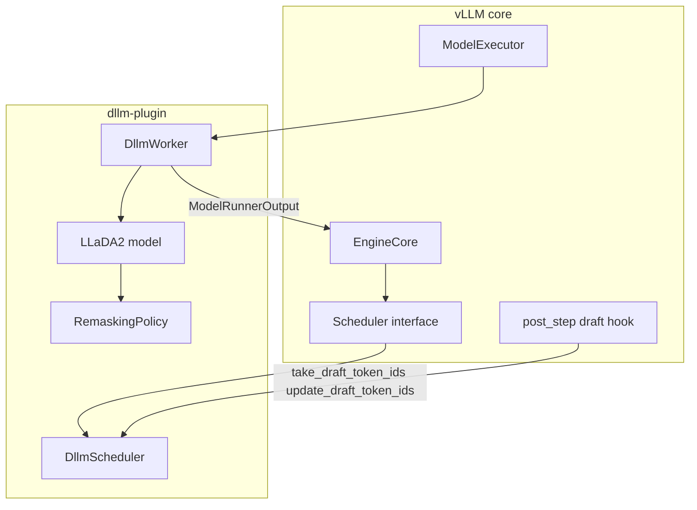
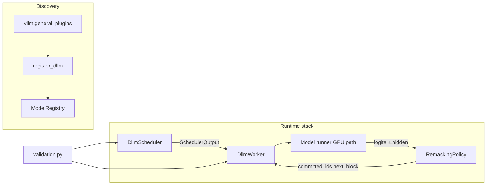
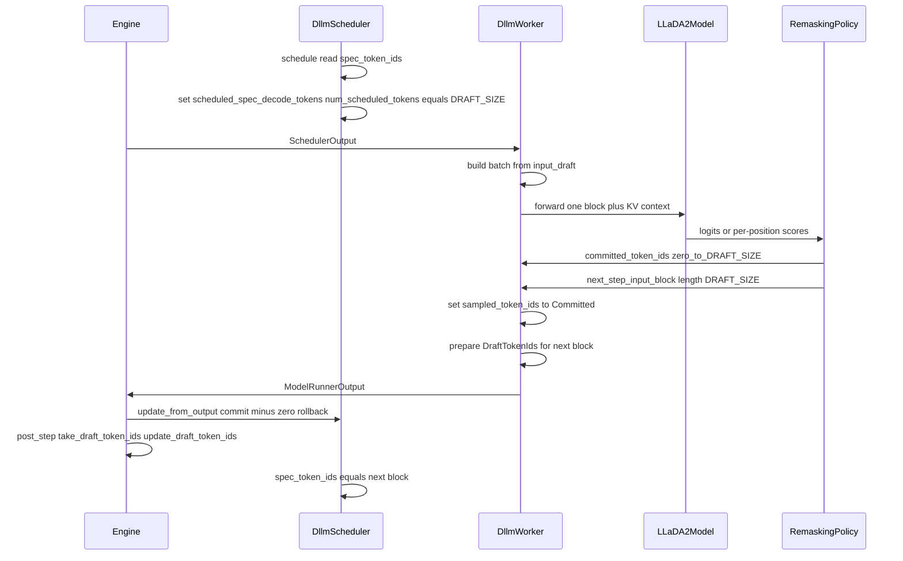
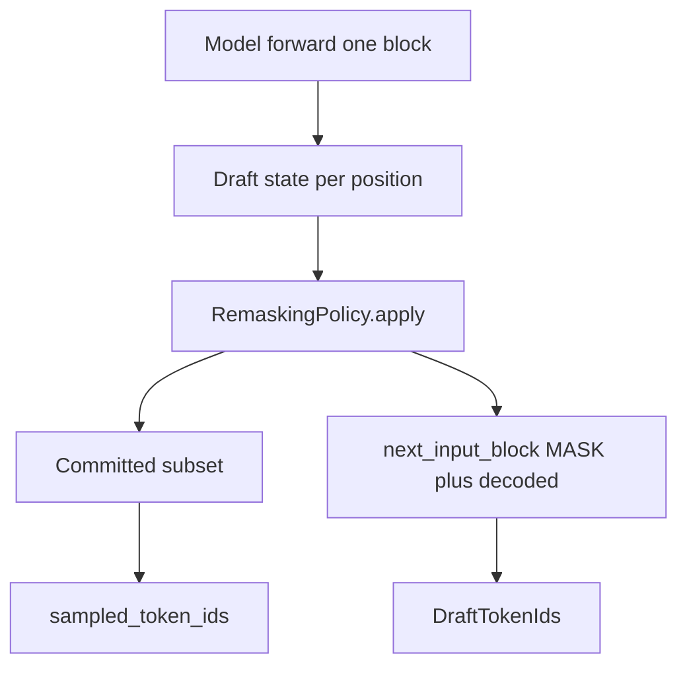

# dLLM plugin — MVP design

This document describes the **MVP architecture** for [`vllm-project/dllm-plugin`](https://github.com/vllm-project/dllm-plugin). It aligns with the public design discussion in [vllm#36155](https://github.com/vllm-project/vllm/issues/36155) (spec-decode path reuse, minimal core change).

**Audience:** implementers and reviewers of the plugin and the minimal vLLM core hook.

---

## 1. MVP goals

| Goal | Notes |
|------|--------|
| **One diffusion step = one worker schedule = one model forward** | Same abstraction as in that discussion; continuous batching stays aligned across requests. |
| **Block size `DRAFT_SIZE`** | Fixed per model (e.g. 32 for LLaDA2.0); one ``input_draft`` in, variable **Committed** (0..DRAFT_SIZE) + fixed **next-step** ``next_input_block`` out. |
| **Reuse spec-decode fields** | No new core tensor types; overload meaning when plugin scheduler + worker are active. |
| **Custom scheduler + worker + registered model** | Loaded via `--scheduler-cls` / `--worker-cls` and `vllm.general_plugins` model registration. |
| **Commit-0** | Plugin scheduler rolls back `num_computed_tokens` when no tokens are committed in a step. |
| **Composable remasking (MVP scope)** | Pluggable **remasking policy** interface after forward (threshold / top-k style); LLaDA2.0 can ship with one default implementation. |
| **First architecture** | LLaDA2.0 inference path end-to-end. |
| **Validation** | Fail fast if a dLLM model is used without the plugin scheduler/worker (or wrong classes). |

**Out of MVP** (see [ROADMAP.md](ROADMAP.md)): grammar/structured outputs beyond “do not break AR grammar on next block”, bespoke CUDA attention kernels where **virtual non-causal chunks** on existing FlashAttention paths are insufficient ([§9](#9-attention-and-execution-mvp)), prefix caching under semi-causal masks, extra architectures, draft streaming UX, and advanced grammar integrations.

---

## 2. Design principles

1. **Thin core, fat plugin** — vLLM change is only the draft-token hook guard; dLLM semantics live in the plugin.
2. **Strict stack** — Model + scheduler + worker are **one supported configuration**; no mixing with default scheduler/worker for dLLM models.
3. **Spec-decode-shaped I/O** — Scheduler and worker agree on overloaded fields so existing batching and executor paths stay exercised.
4. **Remasking behind an interface** — Model forward produces logits/hidden state; **RemaskingPolicy** (or equivalent) updates draft state and decides commit candidates.

---

## 3. Suggested package layout (MVP)

```text
vllm_dllm_plugin/
  __init__.py              # register_dllm() entry for vllm.general_plugins
  config.py                # DRAFT_SIZE, model id constants, feature flags
  validation.py            # assert_compatible_stack(vllm_config)
  scheduler.py             # DllmScheduler (v1 scheduler interface)
  worker.py                # DllmWorker (WorkerBase subclass)
  remasking/
    __init__.py
    base.py                # RemaskingPolicy protocol / ABC
    llada2_default.py       # MVP default for LLaDA2.0
  models/
    __init__.py
    mock_llada2.py         # stack-test stub (Phases 2–6); not production inference
    llada2.py              # real vLLM model module (HF mapping) — Phase 7 / issue #12
```

**Implemented defaults:** `DRAFT_SIZE` (32 for LLaDA2.0 MVP), model identifier
constants, and feature flags live in `vllm_dllm_plugin.config` with docstrings as
the implementer-facing source of truth (milestone issue #3).

Naming is illustrative; the PyPI distribution is **`vllm-dllm-plugin`**.

---

## 4. vLLM core vs plugin boundary



**Core dependency:** After the upstream hook lands in vLLM, `Hook` runs whenever a model step executed and draft IDs exist—not only when `speculative_config` is set. Until then, document a **minimum vLLM version or git SHA** once integration tests pin it (the canonical optional-extra bound lives in `pyproject.toml`; unlike bart-style plugins that often require vLLM at install time, this repo keeps vLLM optional for contributor ergonomics). The exact release containing the hook is tracked via [vllm#36155](https://github.com/vllm-project/vllm/issues/36155), with human-readable tracking context maintained in README and plugin issue [#2](https://github.com/vllm-project/dllm-plugin/issues/2).

---

## 5. Registration and runtime



- **Registration** mirrors [bart-plugin](https://github.com/vllm-project/bart-plugin): one entry point that registers architecture names → qualified model class strings.
- **Runtime** uses the same split of responsibilities: scheduler owns request state for `spec_token_ids`; worker maps `scheduled_spec_decode_tokens` to the forward and fills `sampled_token_ids` + draft return path.

### Forward outputs → remasking (issue #13)

**Handoff module:** `vllm_dllm_plugin.remasking.handoff` — `DllmWorker` (issue #10) should call `remask_after_block_forward(..., policy=...)` after last-rank `compute_logits`, passing the request’s `RemaskingPolicy` (e.g. `Llada2DefaultRemaskingPolicy` for the LLaDA2 MVP), before mapping results into `ModelRunnerOutput.sampled_token_ids` and the draft return path (sections 6–7). The handoff does not choose a default policy.

- **Shape:** 2-D logits `(DRAFT_SIZE, vocab_size)` or an equivalent nested sequence (one row per draft position). Row index `i` aligns with `input_draft[i]` for this block.
- **Pipeline parallel:** only the **last** rank has non-`None` logits; do not run remasking on other ranks (see `docs/MOCK_STACK_MODEL.md` and `vllm_dllm_plugin.models.mock_llada2`).
- **Dtype / device:** follow the logits tensor produced on the runner device; the default policy converts per-row values to Python `float` internally.
- **Batched logits:** a leading batch dimension (e.g. `[batch, DRAFT_SIZE, vocab_size]`) is **out of scope** for the MVP helper; the worker may slice per request or add a batch-aware wrapper later.

---

## 6. One decode step (sequence)



**Commit-0:** In `update_from_output`, if `sampled_token_ids` is empty for a request, the scheduler rolls back `num_computed_tokens` by the number of tokens scheduled that step (typically `DRAFT_SIZE` in this MVP design).

**dLLM inner denoise:** `Llada2DefaultRemaskingPolicy` intentionally returns **empty** `committed_token_ids` on every step while the output draft still contains the mask token; only when the block is fully unmasked does it return the full `DRAFT_SIZE` tuple and an all-mask `next_input_block` for the next block. That means empty commits are **expected** during in-block refinement. `DllmWorker` (issue #10) must either complete the inner denoise loop **before** emitting one engine step, or the stack defines an explicit exception to commit-0 for this mode so the scheduler does not roll back mid-block.

---

## 7. Field mapping (MVP contract)

| vLLM field / API | Role when plugin stack is active |
|------------------|----------------------------------|
| `Request.spec_token_ids` | Next-step ``input_draft`` (length `DRAFT_SIZE`) for the upcoming schedule. |
| `SchedulerOutput.scheduled_spec_decode_tokens` | This step’s ``input_draft`` (length `DRAFT_SIZE`) for the forward; aligns with `RemaskingPolicy.apply(..., input_draft=...)`. |
| `SchedulerOutput.num_scheduled_tokens` (per request) | Set to `DRAFT_SIZE` for decode steps using the block path. |
| `ModelRunnerOutput.sampled_token_ids` | **Committed** token IDs only, length 0..`DRAFT_SIZE` (may be empty). |
| Worker `take_draft_token_ids()` | Returns the next-step ``input_draft`` packaged as `DraftTokenIds` for engine → scheduler. |
| Scheduler `update_draft_token_ids` / `update_draft_token_ids_in_output` | Store next block into `spec_token_ids`; **must not** apply AR draft grammar to dLLM blocks (override for structured output / async). |

Mutually exclusive with true speculative decoding on the same requests: operators must not enable spec-decode + dLLM plugin stack together for the same run mode.

**Contributor copy:** The ASCII summary `docs/CONTRACTS.md` tracks this section (and related timing in section 6). Update both places together when field names or semantics change so they do not drift.

**Upstream drift:** vLLM API identifiers above are accurate for the revision range implied by `pyproject.toml` (optional `vllm` extra). They are not continuously validated against vLLM `main`; when the pin moves, reconcile this table and `docs/CONTRACTS.md` (plugin issue #2 tracks minimum-version / hook context).

---

## 8. Remasking composability (MVP)



**MVP contract (conceptual):**

- **Input:** ``input_draft`` (length `DRAFT_SIZE`), logits (or equivalent), optional request config (threshold, mask id, denoise step index, etc.).
- **Output:** `committed_token_ids: list[int]` (0..N), `next_input_block: list[int]` (length `DRAFT_SIZE`), and internal mask/draft state for logging.

**Shape checks:** `RemaskStepResult` (see `vllm_dllm_plugin.remasking`) does not validate lengths at construction. After `RemaskingPolicy.apply`, the worker or policy boundary should run `validate_remask_step_result()` (same package) or the concrete policy should raise `ValueError` for invalid shapes, consistent with the protocol docstring on `apply`.

**Lists vs tuples:** Conceptual output above uses `list[int]`; the implemented `RemaskStepResult` uses immutable `tuple[int, ...]`. Worker code should convert where vLLM/engine APIs require lists.

**Protocol runtime checks:** `RemaskingPolicy` is `@runtime_checkable`; `isinstance(obj, RemaskingPolicy)` only checks for a callable `apply`, not full signature compliance or return types. Use tests and static typing for the real contract.

**LLaDA2.0 default** is `vllm_dllm_plugin.remasking.llada2_default.Llada2DefaultRemaskingPolicy` (issue #7): per-position argmax and softmax probability at that token; only **mask** positions join confidence-based transfers; decoded positions are preserved; a **transfer-count schedule** over `denoise_steps` (or a `num_transfer` override) combines **strict** thresholding (`confidence > commit_confidence_threshold`) with a top‑k fallback on masked positions when too few exceed the threshold. While the output draft still contains `mask_token_id`, `committed_token_ids` is **empty** and progress is carried in `next_input_block`; when no mask remains, the policy returns the full decoded block as `committed_token_ids` and sets `next_input_block` to an all-mask draft for the following block. Optional `remasking_config` keys and defaults are summarized in `docs/CONTRACTS.md`. Additional policies can plug in as new `RemaskingPolicy` implementations without changing the worker’s engine contract.

**Reference (transfer mechanics):** Mask-gated confidence, per-step transfer counts from `get_num_transfer_tokens`-style layout, strict `confidence > threshold`, and top‑k fallback follow Hugging Face Diffusers [`BlockRefinementScheduler`](https://github.com/huggingface/diffusers/blob/main/src/diffusers/schedulers/scheduling_block_refinement.py) (`get_num_transfer_tokens`, `step`). [`LLaDA2Pipeline`](https://github.com/huggingface/diffusers/blob/main/src/diffusers/pipelines/llada2/pipeline_llada2.py) composes that scheduler for end-to-end block refinement. vLLM-specific **`input_draft`** / Option A semantics remain plugin-layer (§6–7 above).

---

## 9. Attention and execution (MVP)

### 9.1 Virtual sub-requests (reference pattern in vLLM)

vLLM’s **chunked local attention** implements a non-standard attention layout by decomposing a logical sequence into several **virtual requests**. Each virtual request runs **ordinary causal** attention on its own contiguous key range, so existing causal kernels apply. Implementation entry points:

- [`vllm/model_executor/layers/attention/chunked_local_attention.py`](https://github.com/vllm-project/vllm/blob/main/vllm/model_executor/layers/attention/chunked_local_attention.py)
- Backend wiring (commit-pinned line range): [`vllm/v1/attention/backends/utils.py` @ `4ed51308`](https://github.com/vllm-project/vllm/blob/4ed51308c8826619459be858a6dc4333206f41c1/vllm/v1/attention/backends/utils.py#L167-L359)

The dLLM plugin can mirror that **decomposition idea** with a different per-chunk mask: see below.

### 9.2 Mask shapes (schematic, model-dependent)

Exact geometry is architecture-specific; the following ASCII sketches contrast the **chunked-local** staggered window with a **dense block-style** mask common among dLLMs (both shown for six token positions; `1` = allowed attention).

**Chunked local (staggered local windows):**

```text
k_toks >   0 1 2 3 4 5
q_toks v  _____________
       0 | 1
       1 | 1 1
       2 |     1
       3 |     1 1
       4 |         1
       5 |         1 1
```

**Many dLLMs (prefix / block visibility grows by step):**

```text
k_toks >   0 1 2 3 4 5
q_toks v  _____________
       0 | 1 1
       1 | 1 1
       2 | 1 1 1 1
       3 | 1 1 1 1
       4 | 1 1 1 1 1 1
       5 | 1 1 1 1 1 1
```

### 9.3 Decomposition: causal chunks vs non-causal chunks

**Chunked local** effectively splits into virtual requests that each look like a tiny **causal** problem, e.g. keys `{0,1}` for queries `{0,1}`, then keys `{2,3}` for `{2,3}`, then `{4,5}` for `{4,5}`—each sub-matrix is lower-triangular.

**Block-style dLLM masks** can be split analogously into virtual requests where each sub-problem is **fully connected among its allowed (q, k) pairs**—i.e. **standard non-causal** attention on that key/query subset—for example:

```text
virtual req 0 (q,k over {0,1}):   virtual req 1 (over {2,3}):   virtual req 2 (over {4,5}):
       0 | 1 1                         2 | 1 1 1 1                     4 | 1 1 1 1 1 1
       1 | 1 1                         3 | 1 1 1 1                     5 | 1 1 1 1 1 1
```

**FlashAttention** is used with **`is_causal=False`** on these chunks; that path is a normal non-causal workload and is **not** inherently less optimized than other non-causal attention (per upstream attention/maintainer discussion). A **blocked** or arbitrary sparse mask can therefore often be served by **composition of virtual non-causal (and, where needed, causal) chunks** plus FlexAttention or explicit mask metadata—**before** investing in bespoke CUDA.

### 9.4 MVP baseline

- Prefer **FlexAttention**, **FlashAttention with non-causal virtual chunks**, and/or **custom masks** consistent with the public design thread [#36155](https://github.com/vllm-project/vllm/issues/36155).
- **Worker responsibility:** Keep **`num_spec_tokens` / draft buffers** consistent with what `take_draft_token_ids` expects.

---

## 10. Operator configuration (illustrative)

```bash
export VLLM_PLUGINS=dllm
vllm serve <model> \
  --scheduler-cls vllm_dllm_plugin.scheduler:DllmScheduler \
  --worker-cls vllm_dllm_plugin.worker:DllmWorker
```

FQCNs are placeholders until the MVP classes land. Before the first decode schedule, `request.spec_token_ids` must hold the first ``input_draft`` (`DRAFT_SIZE` tokens); the plugin scheduler or worker initializes it (prompt suffix + mask padding per this MVP design).

---

## 11. Risks (MVP)

| Risk | Mitigation |
|------|------------|
| Custom scheduler API not stable | Pin max tested vLLM version; integration tests in CI. |
| Draft hook not in release | Document minimum vLLM from SHA or nightly until released. |
| Structured output + async queue | Implement scheduler overrides early; defer full PDA post-MVP where possible. |
| Wrong worker/scheduler pairing | `validation.py` at model load or worker init. |
